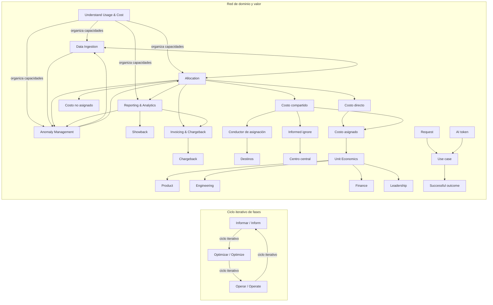

# FP-171 — Glosario conceptual y mapa de relaciones FinOps

> **Estado:** Documento de información verificada. Este documento integra los conceptos de FP-167 a FP-170 para facilitar su lectura conjunta. No contiene un caso aplicado, datos del proyecto, resultados medidos ni definiciones normativas propias de la FinOps Foundation.

## 1. Propósito, alcance y estado

El propósito de FP-171 es ofrecer un glosario breve y un mapa de relaciones que conecten las fases, las personas, el dominio de uso y costo, la asignación de costos y la economía unitaria. La integración ayuda a ubicar cada concepto sin convertir los cuatro entregables anteriores en un único ensayo ni sustituirlos.

El alcance es conceptual. Incluye los términos necesarios para leer conjuntamente las fases de FinOps, sus personas, las capacidades de *Understand Usage & Cost*, la relación entre costo asignado y costo unitario, y las métricas de unidad de negocio y de eficiencia de recursos tratadas en FP-169. No incorpora datos organizacionales, tarifas, fórmulas aplicadas, resultados ni recomendaciones para una empresa concreta.

> **Fuente y estado.** Las entradas marcadas como `Fuente oficial` son síntesis de etiquetas o ideas rastreables a las páginas oficiales indicadas en las referencias. Las entradas marcadas como `Formulación local` son definiciones operativas o reglas de conteo preparadas para integrar el proyecto; se presentan como formulaciones del proyecto y no como reglas universales. `Integración conceptual del proyecto` identifica una conexión entre entregables que no debe leerse como una nueva definición oficial. La fuente oficial vigente es la autoridad para los nombres y las categorías del framework.

## 2. Convenciones de lectura

### 2.1 Niveles del framework

| Nivel | Significado en este documento | Ejemplo |
|---|---|---|
| **Framework** | Marco general que organiza la práctica y sus conceptos. | FinOps Framework |
| **Fase** | Forma de describir el ciclo de trabajo continuo. | Informar, Optimizar, Operar |
| **Dominio** | Agrupación de resultados y capacidades relacionadas. | Understand Usage & Cost |
| **Capacidad** | Práctica concreta dentro de un dominio. | Allocation |
| **Persona** | Grupo que participa en decisiones y responsabilidades de FinOps. | Engineering o ITAM |
| **Métrica o unidad** | Medida de costo, uso, actividad o resultado. | Costo por solicitud |

Las fases no son dominios, los dominios no son personas y las capacidades no son pasos obligatorios de una tubería. Una flecha del mapa representa una dependencia conceptual, un intercambio de información o una retroalimentación; no representa necesariamente orden temporal ni ejecución automática.

### 2.2 Etiquetas de fuente

| Etiqueta | Uso | Lectura correcta |
|---|---|---|
| `Fuente oficial` | Nombre, clasificación o idea sustentada en una fuente oficial del framework o en el material oficial de GenAI citado. | Puede presentarse como síntesis de la fuente, no como cita textual. |
| `Formulación local` | Definición de conteo, criterio operativo, distinción analítica o descripción que la fuente no fija con una fórmula o regla universal. | Es una formulación operativa del proyecto; no debe leerse como una regla universal. |
| `Integración conceptual del proyecto` | Relación entre FP-167, FP-168, FP-169 y FP-170. | Ordena la lectura de los entregables; no amplía la autoridad de las fuentes. |

En cada entrada se conserva el término canónico en inglés y, cuando resulta útil, una traducción de trabajo en español. La traducción facilita la lectura, pero no reemplaza el nombre oficial vigente.

## 3. Glosario

### 3.1 Framework y fases

| Término canónico | Traducción de trabajo | Definición breve | Estado |
|---|---|---|---|
| **FinOps** | Práctica FinOps | Práctica colaborativa para comprender el uso tecnológico, relacionarlo con el costo y orientar decisiones hacia el valor empresarial. | Fuente oficial |
| **Inform** | Informar | Fase que hace visible el uso y el costo para establecer una base común de decisión. | Fuente oficial |
| **Optimize** | Optimizar | Fase que identifica y prioriza mejoras de uso, capacidad, tarifas o diseño considerando costo, calidad y valor. | Fuente oficial |
| **Operate** | Operar | Fase que ejecuta y sostiene acciones, responsabilidades y controles, y devuelve sus resultados al ciclo. | Fuente oficial |
| **Iterative phase cycle** | Ciclo iterativo de fases | Relación continua en la que Informar orienta Optimizar, Optimizar orienta Operar y Operar genera nueva información para Informar. | Fuente oficial |

Las fases pueden ocurrir con ritmos distintos y con participación simultánea de varios equipos. El ciclo es una forma de comprender la mejora continua, no una secuencia que obligue a terminar una fase antes de comenzar otra.

### 3.2 Personas y áreas

| Término canónico | Traducción de trabajo | Definición breve | Estado |
|---|---|---|---|
| **Core Personas** | Personas principales | Categoría de personas que participan directamente en decisiones FinOps y en la responsabilidad compartida sobre el valor del uso tecnológico. El documento actual usa exactamente seis: Engineering, Finance, Procurement, Product, FinOps Practitioner y Leadership. | Fuente oficial |
| **Allied Personas** | Personas aliadas | Disciplinas que se cruzan con FinOps y coordinan cuando sus datos, controles o decisiones son pertinentes. | Fuente oficial |
| **Engineering** | Ingeniería | Aporta arquitectura, dimensionamiento, operación, utilización, desempeño y viabilidad técnica para decidir sobre el consumo. | Fuente oficial |
| **Finance** | Finanzas | Aporta presupuestos, previsiones, clasificación, análisis de variaciones y contexto financiero para reportar el gasto tecnológico. | Fuente oficial |
| **Procurement** | Adquisiciones | Aporta conocimiento de proveedores, licencias, contratos, renovaciones, compromisos y condiciones comerciales. | Fuente oficial |
| **Product** | Producto | Conecta demanda, alcance, hoja de ruta, margen y valor con las decisiones sobre consumo tecnológico. | Fuente oficial |
| **FinOps Practitioner** | Profesional de FinOps | Coordina datos y conversaciones, normaliza información, facilita análisis y ayuda a sostener la cadencia de la práctica sin reemplazar a las demás áreas. | Fuente oficial |
| **Leadership** | Liderazgo | Establece dirección, límites de decisión, recursos, tolerancias y mecanismos de rendición de cuentas. | Fuente oficial |
| **ITAM** | Gestión de activos de TI | Administra inventarios, activos, licencias, propiedad y cumplimiento que ayudan a explicar el gasto y las obligaciones asociadas. | Fuente oficial |
| **ITFM** | Gestión financiera de TI | Organiza registro, categorización, presupuesto y reporte del gasto tecnológico cuando opera como disciplina diferenciada. | Fuente oficial |
| **Sustainability** | Sostenibilidad | Relaciona eficiencia y uso tecnológico con impacto ambiental, políticas y objetivos de sostenibilidad. | Fuente oficial |
| **ITSM / ITIL** | Gestión de servicios de TI | Aporta catálogos, niveles de servicio, desempeño, cambios y continuidad para interpretar el costo de prestar servicios. | Fuente oficial |
| **Security** | Seguridad | Aporta controles, cumplimiento, identidad, exposición, riesgo residual y señales de costo para proteger el entorno tecnológico. | Fuente oficial |

La fuente vigente y el documento actual de FP-168 establecen exactamente seis *Core Personas*: Engineering, Finance, Procurement, Product, FinOps Practitioner y Leadership. Esta es la clasificación oficial adoptada en FP-171.

### 3.3 Dominio Understand Usage & Cost

| Término canónico | Traducción de trabajo | Definición breve | Estado |
|---|---|---|---|
| **Understand Usage & Cost** | Entender el uso y el costo | Dominio que organiza capacidades para obtener datos, atribuir costos, analizarlos y revisar variaciones. | Fuente oficial |
| **Data Ingestion** | Ingesta de datos | Capacidad que obtiene y prepara datos de costo, uso y metadatos para que otras capacidades puedan utilizarlos. | Fuente oficial |
| **Allocation** | Asignación | Capacidad que relaciona costos con destinos mediante evidencia, metadatos y estrategias de asignación. | Fuente oficial |
| **Reporting & Analytics** | Reportes y analítica | Capacidad que transforma costos y uso en vistas comprensibles, análisis y reportes de *showback*. | Fuente oficial |
| **Anomaly Management** | Gestión de anomalías | Capacidad que identifica e investiga variaciones inesperadas y devuelve aprendizajes a datos, asignación y análisis. | Fuente oficial |

Las cuatro capacidades pertenecen al mismo dominio, pero no forman una lista de etapas obligatorias. Sus insumos y resultados se intercambian; por eso el mapa muestra relaciones bidireccionales y retroalimentación.

### 3.4 Allocation y conceptos de asignación

| Término canónico | Traducción de trabajo | Definición breve | Estado |
|---|---|---|---|
| **Allocation target** | Destino de asignación | Producto, servicio, equipo, unidad organizativa o centro de costo al que se atribuye un costo. | Integración conceptual del proyecto |
| **Allocation strategy** | Estrategia de asignación | Conjunto de reglas explícitas para atribuir, distribuir o retener costos con una evidencia y un alcance declarados. | Fuente oficial |
| **Tagging and metadata strategy** | Estrategia de etiquetado y metadatos | Uso de etiquetas, jerarquías y otros metadatos para identificar y agrupar consumo; el metadato no equivale por sí solo a la política de reparto. | Fuente oficial |
| **Shared cost strategy** | Estrategia de costos compartidos | Forma de distribuir o retener un costo que beneficia a varios destinos, mediante un criterio comprensible y revisable. | Fuente oficial |
| **Direct cost** | Costo directo | Costo que puede atribuirse a un único destino sin aplicar un reparto entre varios destinos. | Formulación local |
| **Shared cost** | Costo compartido | Costo que beneficia a varios destinos y requiere distribución o retención central según una decisión explícita. | Integración conceptual del proyecto |
| **Unallocated cost** | Costo no asignado | Costo que todavía no tiene un destino válido según la política y la evidencia disponibles. | Formulación local |
| **Informed ignore** | Retención consciente o *informed ignore* | Decisión de conservar centralmente un costo compartido sin distribuirlo, con conocimiento de la razón y del alcance. | Fuente oficial |
| **Allocation driver** | Conductor de asignación | Medida que representa la participación o el uso de cada destino y sirve para distribuir un fondo compartido. | Fuente oficial |
| **Allocation rate** | Tasa de asignación | Valor práctico por unidad del conductor utilizado para repartir un fondo compartido seleccionado. | Formulación local |
| **Allocation coverage** | Cobertura de asignación | Proporción del costo total que cuenta con un destino válido conforme a la política y la granularidad declaradas. | Formulación local |
| **Conservation** | Conservación | Control que exige conciliar el fondo inicial con lo distribuido y con lo retenido intencionalmente, incluidos los redondeos. | Formulación local |
| **Showback** | Presentación informativa de costos | Comunicación de costos, uso, destinos y reglas de atribución sin producir por sí misma una imputación contable interna. | Fuente oficial |
| **Chargeback** | Imputación interna formal | Traslado o registro formal del costo en presupuestos, centros de costo o sistemas financieros internos. | Fuente oficial |

Las formulaciones de **Allocation rate**, **Allocation coverage** y **Conservation** son operativas y locales: la página oficial de Allocation describe estrategias y algunos indicadores, pero no impone una definición única ni una fórmula obligatoria para estos tres términos. Por eso FP-171 no presenta fórmulas ni convierte estas convenciones en requisitos universales.

El costo compartido y el costo no asignado son conceptos distintos. En el primero se conoce la naturaleza común del gasto, aunque falte decidir cómo distribuirlo o si conviene retenerlo. En el segundo falta una atribución válida, una evidencia suficiente o un mecanismo aplicable. Un costo compartido retenido en un centro central mediante *informed ignore* no se vuelve automáticamente no asignado.

*Showback* es informativo. *Chargeback* es una imputación interna formal y requiere reglas financieras, conciliación y correcciones. **Invoicing & Chargeback** pertenece al dominio **Manage the FinOps Practice**, fuera de **Understand Usage & Cost**; no implica necesariamente un pago externo adicional.

### 3.5 Economía unitaria y producto

| Término canónico | Traducción de trabajo | Definición breve | Estado |
|---|---|---|---|
| **Unit Economics** | Economía unitaria | Capacidad que relaciona costos con unidades técnicas o de negocio para observar eficiencia, sostenibilidad y valor. | Fuente oficial |
| **Quantify Business Value** | Cuantificar el valor empresarial | Dominio que conecta el costo y el uso tecnológico con valor, resultados y decisiones de negocio. | Fuente oficial |
| **Unit cost** | Costo unitario | Costo de un alcance y periodo relacionado con las unidades observadas en ese mismo alcance y periodo. | Integración conceptual del proyecto |
| **Product metric** | Métrica de producto | Medida que ayuda a evaluar decisiones de producto, diseño, margen, precio, hoja de ruta o valor, no solo eficiencia técnica. | Integración conceptual del proyecto |
| **Resource Efficiency Unit Metric** | Métrica unitaria de eficiencia de recursos | Medida de actividad o eficiencia operativa, como solicitudes o tokens, que necesita conectarse con calidad y resultados para apoyar una decisión de producto. | Fuente oficial |
| **Business Unit Metric** | Métrica unitaria de negocio | Medida ligada a una unidad o resultado del negocio, como una transacción completada o un cliente atendido. | Fuente oficial |
| **Fully loaded cost** | Costo con cargas completas | Vista del costo que incorpora, cuando corresponde, infraestructura compartida, datos, observabilidad, soporte y otros componentes previamente asignados. | Formulación local |
| **Numerator** | Numerador | Costo que se pone en relación con una unidad. En la integración del proyecto, FP-170 aporta el costo asignado que puede ocupar esta posición. | Integración conceptual del proyecto |
| **Denominator** | Denominador | Población o volumen de unidades contadas para interpretar el costo bajo un alcance definido. FP-169 selecciona y documenta este criterio. | Formulación local |
| **Population** | Población | Conjunto delimitado de eventos, clientes, solicitudes, tokens u otras unidades que se consideran en una medición. | Formulación local |
| **Scope and period** | Alcance y periodo | Límites de producto, servicio, proceso, fechas, zona horaria y demás inclusiones que deben coincidir entre costo y unidades. | Formulación local |

La distinción central es **asignación → costo asignado → costo unitario**. FP-170 explica cómo se atribuye el gasto; FP-169 decide qué población sirve como denominador y cómo interpretar la métrica. Esta conexión es una integración del proyecto, no una fórmula oficial adicional.

### 3.6 Métricas y unidades de actividad

| Término canónico | Traducción de trabajo | Definición breve | Estado |
|---|---|---|---|
| **Completed transaction** | Transacción completada | Evento de negocio que alcanza el estado definido como finalización válida dentro del alcance y periodo. Los estados incompletos o cancelados requieren una regla explícita. | Formulación local sobre una unidad oficial |
| **Served customer** | Cliente atendido | Cliente único que recibió una prestación o actividad verificable durante el periodo; no equivale automáticamente al total histórico de cuentas. | Formulación local sobre una unidad oficial |
| **Request** | Solicitud | Actividad técnica observada en un punto definido. Puede contarse por intento, éxito u otra población declarada; los reintentos y duplicados deben distinguirse. | Formulación local sobre una unidad oficial |
| **AI token** | Token de IA | Unidad de consumo procesada por un modelo o servicio de IA. Su tratamiento económico depende del proveedor, modelo, modalidad, acceso y alcance medido. | Fuente oficial con conteo local |
| **Input token** | Token de entrada | Categoría de token de entrada que algunos servicios distinguen al medir o cobrar el procesamiento. | Fuente oficial |
| **Output token** | Token de salida | Categoría de token generado como salida que algunos servicios distinguen al medir o cobrar el procesamiento. | Fuente oficial |
| **Cached token** | Token en caché o *prompt caching* | Categoría relacionada con contenido reutilizado o almacenado en caché cuando el servicio la expone con tratamiento económico o de medición diferenciado. | Fuente oficial |
| **Use case** | Caso de uso | Finalidad o actividad de negocio a la que se conecta el consumo técnico de IA. | Fuente oficial |
| **Successful outcome** | Resultado exitoso | Resultado que permite evaluar si el caso de uso cumplió el objetivo, en vez de tratar el conteo de tokens como sustituto automático de valor. | Fuente oficial |

Las categorías de entrada, salida y caché se conservan solo porque están respaldadas por el material oficial de FinOps para GenAI citado en las referencias. FP-171 no establece una taxonomía universal de tokens, no supone que todos los proveedores separen las mismas categorías y no convierte una tarifa por token en una medida suficiente de valor. Las reglas exactas de conteo de transacciones, clientes y solicitudes son formulaciones operativas de FP-169 y no se presentan como definiciones universales.

## 4. Mapa conceptual

El siguiente mapa separa el ciclo de fases de la red de dominio, asignación y valor. Las relaciones de la red son deliberadamente no lineales: hay intercambios y retroalimentación, no una tubería obligatoria. Las conexiones de *Unit Economics* con Product, Engineering, Finance y Leadership son representativas, no exhaustivas; Procurement y FinOps Practitioner también pueden participar según el objetivo y el alcance de la métrica.

### 4.1 Representación textual de respaldo

| Origen | Relación | Destino | Tipo/nota |
|---|---|---|---|
| Informar | orienta y recibe resultados de | Optimizar | Ciclo de fases; no paso aislado. |
| Optimizar | orienta acciones | Operar | Ciclo de fases. |
| Operar | devuelve información a | Informar | Retroalimentación del ciclo iterativo. |
| Understand Usage & Cost | organiza | Data Ingestion | Relación de dominio y capacidad. |
| Understand Usage & Cost | organiza | Allocation | Relación de dominio y capacidad. |
| Understand Usage & Cost | organiza | Reporting & Analytics | Relación de dominio y capacidad. |
| Understand Usage & Cost | organiza | Anomaly Management | Relación de dominio y capacidad. |
| Data Ingestion | intercambia datos y metadatos con | Allocation | Dependencia bidireccional conceptual. |
| Allocation | alimenta | Reporting & Analytics | Los reportes requieren costos y destinos interpretables. |
| Reporting & Analytics | comunica | Showback | Showback informativo. |
| Allocation | aporta información a | Invoicing & Chargeback | Resultado downstream, fuera del dominio. |
| Reporting & Analytics | aporta información a | Invoicing & Chargeback | Requiere reporte y conciliación. |
| Invoicing & Chargeback | formaliza | Chargeback | Imputación interna, no pago externo adicional. |
| Data Ingestion | aporta señales a | Anomaly Management | La calidad de datos condiciona el análisis. |
| Allocation | aporta contexto a | Anomaly Management | Propiedad y reglas ayudan a investigar variaciones. |
| Reporting & Analytics | aporta vistas a | Anomaly Management | El análisis detecta variaciones inesperadas. |
| Anomaly Management | devuelve hallazgos a | Data Ingestion | Puede exigir corregir fuentes o metadatos. |
| Anomaly Management | devuelve hallazgos a | Allocation | Puede exigir revisar destinos o reglas. |
| Allocation | produce o identifica | Costo asignado | Salida informativa para un alcance declarado. |
| Costo compartido | requiere | Conductor de asignación | Solo cuando se decide distribuirlo. |
| Conductor de asignación | relaciona | Destinos | Representa participación o uso. |
| Costo compartido | puede retenerse mediante | Informed ignore | El destino central debe quedar explícito. |
| Informed ignore | conserva en | Centro central | No convierte el costo en no asignado. |
| Costo no asignado | permanece distinto de | Costo compartido | Estado de atribución, no naturaleza común del gasto. |
| Costo asignado | puede servir como numerador de | Unit Economics | Integración FP-170 → FP-169. |
| Unit Economics | informa decisiones de | Product | La métrica puede ser de producto. |
| Unit Economics | informa decisiones de | Engineering | Conecta diseño y eficiencia con costo. |
| Unit Economics | informa decisiones de | Finance | Apoya margen, presupuesto y valor. |
| Unit Economics | informa decisiones de | Leadership | Apoya priorización y dirección. |
| Request | se conecta con | Use case | Señal técnica contextualizada. |
| AI token | se conecta con | Use case | No es valor por sí mismo. |
| Use case | se evalúa mediante | Successful outcome | Conexión técnica con resultado de negocio. |

Todas las flechas anteriores son dependencias, intercambios o retroalimentaciones conceptuales. No prescriben una ejecución lineal, una herramienta concreta ni una política contable.

## 5. Handoffs y límites de alcance

| Entregable de referencia | Handoff que conserva FP-171 | Límite |
|---|---|---|
| [fp-167 Las fases de FinOps.md](./fp-167%20Las%20fases%20de%20FinOps.md) | Presenta Informar, Optimizar y Operar como marco del ciclo iterativo. | FP-171 integra el ciclo; no reescribe las fases. |
| [fp-168 Roles y participacion.md](./fp-168%20Roles%20y%20participacion.md) | Presenta las personas principales y aliadas que participan en decisiones y responsabilidades. | FP-171 conserva las seis personas oficiales; Negocio se usa solo como contexto, no como persona adicional. |
| [fp-170 Asignacion de costos.md](./fp-170%20Asignacion%20de%20costos.md) | Aporta el costo asignado que puede ocupar el numerador, junto con el vocabulario de Allocation. | FP-171 no duplica reglas de etiquetas, reparto, cobertura ni conciliación. |
| [fp-169 Economia unitaria.md](./fp-169%20Economia%20unitaria.md) | Define el denominador, la población, la interpretación y el costo unitario como métrica de producto. | FP-171 no calcula métricas ni fija poblaciones para un caso aplicado. |

FP-171 integra únicamente relaciones de lectura. Las reglas locales de FP-169 y FP-170 se presentan como formulaciones operativas del proyecto y no como definiciones oficiales. No hay datos aplicados, empresas, tarifas, resultados ni ejemplos numéricos del proyecto.

El documento preparatorio de FP-171 conserva un handoff anterior cuya referencia a otras tareas quedó desactualizada. Se actualizó únicamente su ruta a la bitácora canónica; FP-171 no crea enlaces a FP-53, FP-54 ni FP-56 porque no se localizaron archivos actuales con esos identificadores.

## 6. Verificación y limitaciones

La verificación de esta entrega y de los cuatro documentos base fue documental y estructural: se leyeron los cuatro entregables actuales, el consolidado preparatorio, la cola más reciente de la bitácora y las fuentes oficiales citadas antes de integrar. Se mantienen explícitos los siguientes límites:

- **Alcance conceptual:** FP-167 a FP-171 no contienen datos aplicados, tarifas del caso, cálculos aplicados, resultados medidos ni recomendaciones para una empresa concreta.
- **Core Personas:** la clasificación vigente de la fuente y FP-168 contiene exactamente seis personas principales: Engineering, Finance, Procurement, Product, FinOps Practitioner y Leadership. Esta es la clasificación adoptada en FP-171.
- **Terminología y formulaciones locales:** se normalizaron los nombres canónicos y las traducciones de trabajo en los documentos editados. Las reglas de conteo, cobertura, conservación, conductores y otras decisiones operativas se mantienen identificadas como formulaciones del proyecto, no como requisitos universales.
- **Matriz de fuentes:** la fila 002 conserva el host `framework.finops.org` para Allocation, mientras los documentos actuales usan la URL canónica `www.finops.org`; la matriz no se modificó en esta intervención.
- **Puente preparatorio:** el consolidado conserva referencias históricas a FP-53, FP-54 y FP-56; no se crean enlaces a tareas que no se localizaron.
- **Renderizado:** el mapa se comprobó como Markdown legible por inspección estructural; su renderizado específico en Obsidian no se validó en esta intervención.

## 7. Referencias

Las referencias siguientes son las URL oficiales utilizadas por los cuatro documentos actuales y las páginas de contexto verificadas durante el mapeo previo. La fecha de integración y consulta documental de esta entrega es **2026-09-17**. No se incorporan páginas cuya verificación no esté registrada.

### 7.1 Framework, fases y personas

| Fuente | URL | Uso en la integración |
|---|---|---|
| FinOps Framework | [finops.org/framework](https://www.finops.org/framework/) | Contexto general registrado en la matriz y en el mapeo. |
| FinOps Phases | [finops.org/framework/phases](https://www.finops.org/framework/phases/) | Fases y ciclo Informar–Optimizar–Operar. |
| FinOps Principles | [finops.org/framework/principles](https://www.finops.org/framework/principles/) | Contexto de valor, colaboración y responsabilidad. |
| FinOps Personas | [finops.org/framework/personas](https://www.finops.org/framework/personas/) | Clasificación de Core Personas y Allied Personas. |
| Engineering Persona | [finops.org/framework/persona/engineering](https://www.finops.org/framework/persona/engineering/) | Definición resumida de Engineering. |
| Finance Persona | [finops.org/framework/persona/finance](https://www.finops.org/framework/persona/finance/) | Definición resumida de Finance. |
| Procurement Persona | [finops.org/framework/persona/procurement](https://www.finops.org/framework/persona/procurement/) | Definición resumida de Procurement. |
| Product Persona | [finops.org/framework/persona/product](https://www.finops.org/framework/persona/product/) | Definición resumida de Product. |
| FinOps Practitioner Persona | [finops.org/framework/persona/finops-practitioner](https://www.finops.org/framework/persona/finops-practitioner/) | Definición resumida de FinOps Practitioner. |
| Leadership Persona | [finops.org/framework/persona/leadership](https://www.finops.org/framework/persona/leadership/) | Definición resumida de Leadership. |

### 7.2 Dominios, capacidades y GenAI

| Fuente | URL | Uso en la integración |
|---|---|---|
| Understand Usage & Cost | [finops.org/framework/domains/understand-usage-cost](https://www.finops.org/framework/domains/understand-usage-cost/) | Dominio y sus cuatro capacidades vigentes. |
| Data Ingestion | [finops.org/framework/capabilities/data-ingestion](https://www.finops.org/framework/capabilities/data-ingestion/) | Datos de costo, uso y metadatos. |
| Allocation | [finops.org/framework/capabilities/allocation](https://www.finops.org/framework/capabilities/allocation/) | Asignación, etiquetado, costos compartidos y estrategias. |
| Reporting & Analytics | [finops.org/framework/capabilities/reporting-analytics](https://www.finops.org/framework/capabilities/reporting-analytics/) | Analítica y *showback reporting*. |
| Anomaly Management | [finops.org/framework/capabilities/anomaly-management](https://www.finops.org/framework/capabilities/anomaly-management/) | Detección, investigación y retroalimentación. |
| Invoicing & Chargeback | [finops.org/framework/capabilities/invoicing-chargeback](https://www.finops.org/framework/capabilities/invoicing-chargeback/) | Imputación formal posterior y ubicación en otro dominio. |
| Quantify Business Value | [finops.org/framework/domains/quantify-business-value](https://www.finops.org/framework/domains/quantify-business-value/) | Relación entre costo, valor y decisiones. |
| Unit Economics | [finops.org/framework/capabilities/unit-economics](https://www.finops.org/framework/capabilities/unit-economics/) | Unidades técnicas y de negocio, tendencias y decisiones. |
| GenAI FinOps: How Token Pricing Really Works | [finops.org/wg/genai-finops-how-token-pricing-really-works](https://www.finops.org/wg/genai-finops-how-token-pricing-really-works/) | Cautela sobre categorías y tratamientos de tokens. |
| GenAI FinOps vs. Cloud FinOps | [finops.org/wg/genai-finops-vs-cloud-finops](https://www.finops.org/wg/genai-finops-vs-cloud-finops/) | Relación entre consumo técnico, caso de uso y resultado exitoso. |

### 7.3 Fuentes de contexto verificadas por el mapeo

| Fuente | URL | Límite de uso |
|---|---|---|
| FOCUS Specification 1.4 | [focus.finops.org/docs/specification/v1-4](https://focus.finops.org/docs/specification/v1-4/) | Contexto de normalización de datos; no fija las definiciones locales de FP-171. |
| OpenCost Documentation | [opencost.io/docs](https://opencost.io/docs/) | Contexto técnico limitado a Kubernetes; no se usa como definición general de FinOps. |

### 7.4 Antecedente académico

Tak, B. C., Kwon, Y. y Urgaonkar, B. (2017). *Resource Accounting of Shared IT Resources in Multi-Tenant Clouds*. **IEEE Transactions on Services Computing, 10**(2), 302–315. [DOI: 10.1109/TSC.2015.2453980](https://doi.org/10.1109/TSC.2015.2453980). Se conserva como antecedente técnico sobre atribución de uso compartido; no define una política FinOps ni una regla universal de reparto.

### 7.5 Evidencia documental del repositorio

- Matriz de fuentes verificada en `docs/TINV_Matriz_de_Fuentes_final_2026-09-13.xlsm - Matriz de Fuentes.csv`.
- Trazabilidad canónica en `papers/info_mds/_trazabilidad/research-log.md`.
