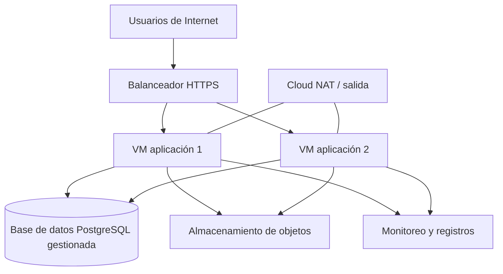

# FP-182 — Arquitectura y supuestos del escenario TCO

> **Estado:** borrador generado con IA, trazable y pendiente de validación humana. No es entregable final ni sustituye el análisis, los criterios, las conclusiones o recomendaciones de autoría humana exigidos por la sección 6.1 de las indicaciones del curso.
>
> **Propósito:** dejar un caso base reproducible para que el equipo cotice el TCO de cinco años y compare Santiago con Estados Unidos. Los valores son parámetros editables, no mediciones ni precios vigentes.

## Decisión propuesta para revisión

**Caso base:** aplicación web transaccional IaaS de tres capas, con demanda variable. La plataforma de referencia propuesta es Google Cloud; se replica sin cambios lógicos en `southamerica-west1` (Santiago) y `us-central1` (EE. UU.).

Esta es una **decisión de diseño del equipo pendiente de firma**, no una conclusión de los papers. La bibliografía respalda que una solución cloud debe considerar cómputo, almacenamiento, red, plataforma y requisitos del usuario; no prescribe Google Cloud, una región ni estos tamaños.

## Alcance y exclusiones

| Incluido para el TCO | Excluido o pendiente de definir |
|---|---|
| Producción, desarrollo y pruebas; cómputo, base de datos, almacenamiento, red, balanceo, NAT, registros/monitoreo, respaldos y soporte. | Desarrollo de la aplicación, migración, capacitación, impuestos, costos laborales, CDN/WAF, identidad, DR multirregional y licencias de terceros. Se incorporan solo con evidencia y aprobación humana. |

## Componentes y unidades de consumo

| Capa | Servicio de referencia | Cantidad / configuración inicial editable | Unidad para cotizar | Justificación del supuesto |
|---|---|---:|---|---|
| Entrada | Balanceador HTTPS | 1 regional | reglas, GB procesados y horas si aplica | Permite distribuir solicitudes y hacer explícito el costo de entrada. |
| Aplicación | Managed Instance Group de VMs | mínimo 2, máximo 4; 2 vCPU y 8 GiB por VM | horas de VM, vCPU-hora, GiB-hora y disco | Dos réplicas son un mínimo operativo propuesto para continuidad ante falla de una instancia; el máximo debe validarse con carga. |
| Datos | PostgreSQL gestionado con HA zonal | 2 vCPU, 8 GiB RAM, 100 GiB SSD; HA: sí | hora de instancia, GiB-mes, operaciones/backup | Representa persistencia transaccional y separa costo de cómputo de datos. Tamaño y HA no son un dato de los papers. |
| Objetos | Almacenamiento estándar | 500 GiB iniciales | GiB-mes, operaciones, recuperación y egreso | Captura archivos, respaldos y crecimiento de datos fuera de la BD. |
| Red | NAT y salida a Internet | 200 GB/mes de salida inicial | GB procesados, horas de NAT y GB de egreso | El egreso es una partida que TI-06 exige no omitir. |
| Observabilidad | Logging y Monitoring | 50 GiB/mes de registros | GiB ingeridos/almacenados y retención | Hace visible un costo operacional que suele quedar fuera de la primera cotización. |
| Ambientes no productivos | VMs y BD reducidas | 1 VM equivalente + BD reducida; 12 h/día, 22 días/mes | mismas unidades de cada servicio | Permite cuantificar el apagado programado como palanca FinOps. |

## Supuestos revisables del escenario

### Demanda, datos y tráfico

| Variable | Valor inicial editable | Regla de cálculo o interpretación | Estado |
|---|---:|---|---|
| Usuarios registrados | 10.000 | Usuarios totales al inicio del año 1. | Pendiente de validar |
| Usuarios activos mensuales | 2.000 | 20 % de usuarios registrados; no implica concurrencia. | Pendiente de validar |
| Solicitudes mensuales | 1.000.000 | 500 solicitudes por usuario activo/mes; revisar con el caso del curso. | Pendiente de validar |
| Pico de demanda | 3× promedio horario | Parámetro para definir mínimo/máximo de instancias; no es medición. | Pendiente de validar |
| Datos iniciales | 500 GiB | Objetos, adjuntos y respaldos; separado de datos de BD. | Pendiente de validar |
| Crecimiento de datos | 20 % anual | Se aplica al cierre de cada año del horizonte. | Pendiente de validar |
| Egreso Internet | 200 GB/mes | Descargas/respuestas hacia usuarios; no incluye tráfico interno sin precio. | Pendiente de validar |
| Retención de logs | 30 días | Volumen inicial de 50 GiB/mes; ajustar al requerimiento de auditoría. | Pendiente de validar |

### Supuestos técnicos y operativos

| Variable | Propuesta | Por qué se declara | Aprobación humana |
|---|---|---|---|
| Disponibilidad objetivo | 99,9 % mensual para la capa de aplicación | Permite traducir continuidad en dos réplicas y monitoreo; no equivale al SLA contractual de cada servicio. | [ ] |
| RPO / RTO | RPO 24 h; RTO 4 h | Valores iniciales para decidir respaldos y recuperación; deben venir del negocio. | [ ] |
| Escalamiento | mínimo 2 / máximo 4 VMs, gatillado por CPU o solicitudes | Modela demanda variable sin introducir Kubernetes sin datos de workloads. | [ ] |
| Ambientes no productivos | desarrollo y pruebas apagados fuera de horario definido | Palanca de optimización y supuesto operacional medible. | [ ] |
| Igualdad regional | mismo diseño, parámetros y horizonte en ambas regiones | Aísla la ubicación/precio como objeto de comparación; cambios por catálogo se documentarán por separado. | [ ] |

### Supuestos financieros y de modelación

| Variable | Valor inicial editable | Regla |
|---|---:|---|
| Horizonte | 5 años | 60 meses; reportar mensual y acumulado. |
| Moneda | USD | Registrar conversión a CLP solo si se incorpora, con fecha y fuente. |
| Modelo de precio | lista pública | Reemplazar por cotización si el proveedor no publica el componente. |
| Fecha de precios | pendiente | Toda cifra debe registrar producto, región, moneda, fecha y modalidad. |
| Descuento por compromiso | 0 % en línea base | Escenario alternativo: aplicar solo tras verificar elegibilidad y plazo. |
| Inflación / variación de precio | 0 % nominal | No es predicción; sensibilidad separada si el equipo la justifica. |
| Soporte | pendiente de cotización | Incluir si la oferta o el nivel de soporte lo exige; no asumir que es gratuito. |

## Replicabilidad regional y cotización

| Elemento | Santiago | EE. UU. | Regla de comparación |
|---|---|---|---|
| Región | `southamerica-west1` | `us-central1` | Misma configuración lógica y mismos parámetros de demanda. |
| Catálogo y precio | Consultar calculadora/fuente oficial en la fecha de cotización | Consultar calculadora/fuente oficial en la misma fecha | Registrar servicio, SKU/configuración, moneda, fecha, fuente y restricciones regionales. |
| Resultado esperado | TCO 5 años por componente | TCO 5 años por componente | No atribuir la diferencia solo a la región si cambia una SKU o disponibilidad. |

La disponibilidad regional debe comprobarse nuevamente al cotizar, porque el catálogo y los precios cambian. La elección de las regiones es un supuesto verificable de diseño, no evidencia académica.

## Palancas FinOps a cuantificar en la siguiente etapa

| Palanca | Línea base | Escenario a medir | Indicador |
|---|---|---|---|
| Dimensionamiento correcto | 2 vCPU / 8 GiB por VM | VM menor o mayor según utilización validada | ahorro mensual y TCO a 5 años |
| Compromiso vs. pago por uso | 100 % precio de lista | compromiso solo para capacidad estable | ahorro vs. línea base y riesgo de sobrecompra |
| Apagado no productivo | 24×7 | 12 h/día, 22 días/mes | horas evitadas y ahorro anual |
| Almacenamiento / retención | estándar y 30 días de logs | política de ciclo de vida y retención aprobada | GiB-mes y costo de recuperación |
| Egreso | 200 GB/mes | -25 % / +50 % | costo por GB y participación en factura |

## Sensibilidad prevista

La etapa de TCO debe seleccionar las **dos variables de mayor impacto después de cotizar**. Hasta entonces, candidatas: (1) horas/capacidad de cómputo de aplicación y base de datos; (2) egreso a Internet. Se probarán al menos un escenario bajo y alto documentados; no se debe afirmar cuáles dominan sin resultados.

## Evidencia, decisiones y límites

| Tipo | Afirmación trazable | Fuente local |
|---|---|---|
| Evidencia académica | Diseñar una solución cloud implica recursos de cómputo, almacenamiento, red y plataforma, además de requisitos del usuario. | `FP-48 TINV02/Papers academicos - FP-48/markdown/012-Optimizing cloud solutioning design.md`, líneas 74–109. |
| Evidencia académica | IaaS comprende infraestructura como servidores, capacidad de procesamiento y almacenamiento; los SLA son parte del modelo de servicio. | `.../009-Identification of a company’s suitability for the adoption of cloud.md`, líneas 33–35 y 56–60. |
| Evidencia académica | La gestión FinOps requiere propiedad de costos, presupuesto y optimización, sin que ello fije una arquitectura específica. | `.../01_Manurung_Aji_2025_FinOps_Implementation.md`, líneas 10–35 y 69–71. |
| Exigencia del encargo | TCO a cinco años, tres palancas cuantificadas, comparación Santiago/EE. UU. y sensibilidad de dos variables. | `INVESTIGACION/Indicaciones_Trabajo_de_Investigacion_2026.md`, sección TI-06. |
| Decisión pendiente del equipo | IaaS multi-tier, Google Cloud y regiones propuestas; tamaños, demanda y SLA de este documento. | Este borrador; requiere firma y verificación con fuentes oficiales. |

## Checklist de validación humana

- [ ] El equipo aprueba o modifica la arquitectura, proveedor y regiones.
- [ ] El responsable del caso confirma usuarios, solicitudes, concurrencia, crecimiento, datos y egreso.
- [ ] Un responsable técnico valida tamaños, autoscaling, HA, RPO/RTO y SLA objetivo.
- [ ] Se verifica en fuente oficial la disponibilidad de cada servicio/SKU en ambas regiones.
- [ ] Cada precio registra producto, configuración, región, moneda, fecha, fuente y modalidad.
- [ ] Se incorpora o descarta explícitamente soporte, licencias, no-producción, respaldos, red interzonal y egreso.
- [ ] Se cuantifican al menos tres palancas y se eligen las dos sensibilidades desde resultados de cotización.
- [ ] Se revisa la bitácora y el anexo de uso de IA antes de reutilizar contenido.

## Firma de decisión

| Decisión | Resultado | Responsable | Fecha |
|---|---|---|---|
| Arquitectura y plataforma | [ ] Aprobar [ ] Modificar [ ] Rechazar |  |  |
| Supuestos de demanda y datos | [ ] Aprobar [ ] Modificar [ ] Rechazar |  |  |
| Supuestos de continuidad y operación | [ ] Aprobar [ ] Modificar [ ] Rechazar |  |  |
