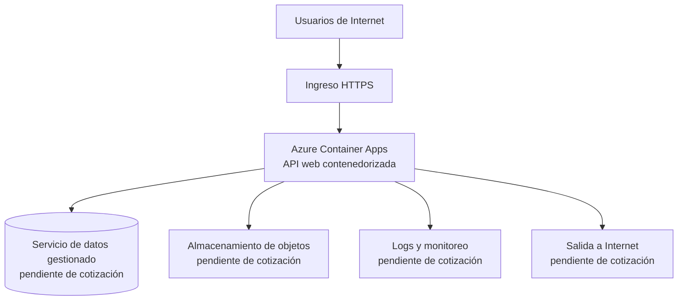

# FP-182 — Arquitectura y supuestos del escenario TCO

> **Estado:** borrador actualizado con asistencia de IA, trazable y pendiente de validación humana. No constituye el entregable final ni sustituye las conclusiones o recomendaciones de autoría humana exigidas por el curso.

## Decisión propuesta para revisión

**Se reemplaza la propuesta previa de Google Cloud IaaS por una arquitectura PaaS basada en Azure Container Apps.** La comparación regional usa la misma configuración en **Chile Central** y **East US**.

La razón es verificable: la matriz FP-48 ya contiene precios públicos comparables para Azure Container Apps en ambas regiones, con las mismas tres unidades de cobro: vCPU-segundo, GiB-segundo y un millón de solicitudes. La propuesta anterior no tenía precios GCP registrados en FP-48, por lo que no permitía una comparación regional reproducible.

Esta decisión **no convierte los precios existentes en un TCO completo**. Los servicios de datos, almacenamiento, egreso y observabilidad siguen pendientes de cotización oficial en ambas regiones.

## Alcance del escenario

| Incluido | Estado de precio en FP-48 |
|---|---|
| Ejecución de la API en Azure Container Apps: CPU, memoria y solicitudes. | **Cotizable y comparable** para Chile Central y East US. |
| Servicio de datos gestionado, almacenamiento de objetos, egreso, logs/monitoreo, respaldo y soporte. | Pendiente: deben agregarse precios oficiales pareados antes de cerrar FP-183 o FP-185. |
| Desarrollo, migración, impuestos, CDN/WAF, identidad, DR multirregional y licencias de terceros. | Excluido salvo evidencia y aprobación humana. |

## Componentes, unidades y supuestos editables

| Capa | Servicio de referencia | Configuración inicial editable | Unidad de cotización | Estado |
|---|---|---:|---|---|
| Aplicación | Azure Container Apps | 1 vCPU; 2 GiB; 730 horas/mes de uso activo | vCPU-segundo y GiB-segundo | Precio FP-48 disponible en ambas regiones. |
| Entrada | Solicitudes de Azure Container Apps | 1.000.000 solicitudes/mes | millón de solicitudes | Precio FP-48 disponible en ambas regiones. |
| Datos | Base de datos gestionada compatible | 100 GiB iniciales; HA por definir | capacidad, cómputo, backup y operaciones | Pendiente de precio y SKU equivalente. |
| Objetos | Almacenamiento de objetos | 500 GiB iniciales; 20 % crecimiento anual | GiB-mes, operaciones, recuperación y egreso | Pendiente de precio y SKU equivalente. |
| Red | Salida a Internet | 200 GB/mes | GB de egreso | Pendiente de precio y regla regional. |
| Observabilidad | Logs y monitoreo | 50 GiB/mes; retención de 30 días | GiB ingeridos, almacenados y retenidos | Pendiente de precio y SKU equivalente. |
| No producción | Azure Container Apps | 12 h/día, 22 días/mes | mismas unidades de la aplicación | Palanca futura; no sumar como ahorro antes de modelar la base 24x7. |

## Datos de precio existentes en FP-48

| Medidor | Chile Central | East US | Unidad normalizada | Fecha de matriz |
|---|---:|---:|---|---|
| CPU activa estándar | USD 0,1224 | USD 0,0864 | USD/vCPU-hora | 2026-09-13 |
| Memoria activa estándar | USD 0,0144 | USD 0,0108 | USD/GiB-hora | 2026-09-13 |
| Solicitudes estándar | USD 0,40 | USD 0,40 | USD por millón de solicitudes | 2026-09-13 |

Los importes se transcriben desde la hoja `Matriz de precios` de FP-48. Son precios de lista y no incluyen descuentos, créditos ni compromisos. Se debe revisar la fuente oficial el día de la entrega.

## Reglas de comparabilidad regional

1. Mantener iguales código, imagen de contenedor, CPU, memoria, solicitudes, horas activas, horizonte y moneda.
2. Cambiar solo la región y la tarifa oficial asociada a cada medidor.
3. No usar una SKU distinta para explicar una diferencia como si fuera solo regional.
4. No calcular el TCO total ni un porcentaje de ahorro hasta completar las partidas pendientes en ambos territorios.
5. Registrar para cada precio producto, SKU o medidor, región, moneda, fecha, modalidad y URL oficial.

## Palancas FinOps preparadas, no cuantificadas aún

| Palanca | Base | Cambio posible | Riesgo o condición |
|---|---|---|---|
| Dimensionamiento | 1 vCPU y 2 GiB activos | Ajustar CPU/memoria según utilización medida | No reducir sin métricas de latencia, errores y saturación. |
| Escala a cero / horarios no productivos | Definir base 24x7 antes de medir | Detener ambientes no productivos fuera de horario | No aplica al servicio productivo si vulnera el SLA. |
| Compromisos y descuentos | Precio de lista | Evaluar solo con uso estable y elegibilidad verificada | Evitar sobrecompra y no mezclarlo con el ahorro de rightsizing. |

## Validación humana pendiente

- [ ] El equipo aprueba Azure Container Apps como plataforma común para FP-182, FP-183 y FP-185.
- [ ] Se confirma que el caso puede ejecutarse como API web contenedorizada y se valida el perfil de carga.
- [ ] Se incorporan cotizaciones oficiales pareadas para datos, objetos, egreso, observabilidad, respaldo y soporte.
- [ ] Se verifica disponibilidad de cada servicio y SKU en Chile Central y East US.
- [ ] Se actualiza FP-183 para sustituir sus líneas GCP por las unidades Azure y no interpretar resultados hasta completar precios.
- [ ] Se actualiza FP-185 con la comparación regional solo después de completar las partidas pendientes.

## Trazabilidad

| Tipo | Evidencia |
|---|---|
| Precios comparables | `FP-48 TINV02/TINV_Matriz_de_Fuentes_final_2026-09-13.xlsm`, hoja `Matriz de precios`, filas 2–7. |
| Selección de plataforma | Misma matriz, hoja `Alternativas`, fila 3; Azure Container Apps está identificado para Chile Central. |
| Requisito de comparación | Jira FP-185 y las indicaciones TI-06: arquitectura, volumen y periodo constantes entre Santiago y Estados Unidos. |
| Límite | FP-48 todavía no contiene las tarifas de los componentes no computacionales requeridos para un TCO completo. |