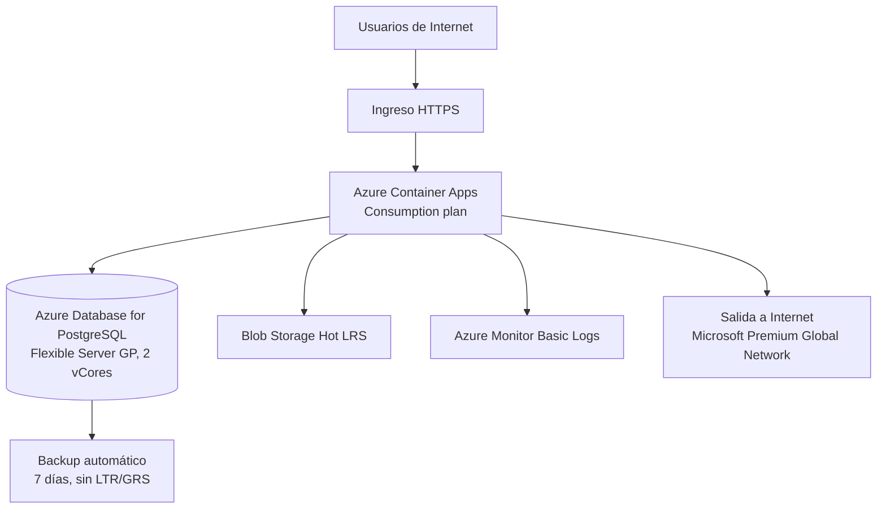

# FP-182 — Arquitectura y supuestos del escenario TCO

> **Estado:** escenario ilustrativo preparado para revisión humana. No es una arquitectura productiva aprobada ni una cotización contractual.

## Decisión de alcance

Para cumplir TI-06 se adopta un **caso ilustrativo común**: una API web contenedorizada desplegada en Microsoft Azure. La misma arquitectura, demanda, horizonte y moneda se comparan en **Chile Central** y **East US**. La selección no proviene de un sistema real descrito en el repositorio; es el escenario acordado para poder ejecutar FP-183 a FP-186 de forma reproducible.

## Configuración base

| Capa | Configuración comparable | Regla de costo |
|---|---|---|
| Aplicación | Azure Container Apps, plan Consumption; 1 vCPU y 2 GiB activos; producción 730 h/mes | Se aplican primero a producción las franquicias mensuales por suscripción: 180.000 vCPU-s, 360.000 GiB-s y 2 millones de solicitudes. Se asume que la franquicia está íntegramente disponible para cada alternativa regional. |
| No producción | 0,5 vCPU, 1 GiB, 264 h/mes y 100.000 solicitudes/mes | Consume la franquicia remanente después de producción. Puede escalar a cero fuera de la ventana declarada. |
| Datos | PostgreSQL Flexible Server General Purpose, **2 vCores**, 100 GiB | General Purpose no ofrece 1 vCore; 2 vCores es el mínimo desplegable. HA queda desactivada en la línea base. |
| Objetos | Blob Storage Hot LRS, 500 GB iniciales, 20 % de crecimiento anual | Se modela capacidad. Operaciones, lectura y recuperación quedan explícitamente fuera por falta de volumen. |
| Red | 200 GB/mes de salida a Internet | Se descuentan los primeros 100 GB/mes y se usa Microsoft Premium Global Network: tarifa de Sudamérica para Chile Central y Norteamérica para East US. |
| Observabilidad | 50 GB/mes de Basic Logs, retención de 30 días | Se modela ingesta; consultas y retención adicional quedan fuera. |
| Respaldo | Backup automático de PostgreSQL, 7 días | Hasta 100 % del storage provisionado no tiene cargo adicional. Excedente base: 0 GiB. No se usa Azure Backup LTR. |

## Disponibilidad, SLA y continuidad

- PostgreSQL se modela **sin HA** para evitar duplicar cómputo y storage sin un requisito aprobado. La referencia de Microsoft indica 99,9 % para la configuración sin HA.
- Chile Central y East US ofrecen HA zonal y zone-redundant para PostgreSQL General Purpose. Activarla exige un escenario separado porque replica cómputo y almacenamiento.
- El backup geo-redundante de PostgreSQL está disponible en East US y no en Chile Central. Por eso no se incluye en la base comparable.
- La latencia desde Chile se expresa como expectativa de proximidad, no como medición. FP-185 conserva este pendiente.

## Categorías TCO y tratamiento de faltantes

| Categoría | Tratamiento base |
|---|---|
| Licencias de terceros | No aplica justificado: PostgreSQL es open source y no se declaró software tercero. |
| Soporte | Azure Basic Support, sin cargo adicional; validar si el caso exige un plan pago. |
| Tráfico interzona | No aplica en la base porque HA está desactivada y los servicios se consideran colocados en una región. |
| Operaciones Blob y consultas de Monitor | Excluidas explícitamente por falta de volúmenes; no se presentan como ahorro. |
| Esfuerzo operativo | **Pendiente:** faltan horas/mes y tarifa USD/h. Un vacío no se interpreta como cero. |
| Implementación de optimizaciones | Se registra en FP-184 y queda pendiente de cifra humana antes de informar ahorro neto. |

## Trazabilidad

| Evidencia | Uso |
|---|---|
| `docs/fp-172/TINV-04_FinOps_maestro_2026-09-15_v1_FP-172.xlsx` | Palancas, regiones y parámetros TCO de FP-172/174/176. |
| `FP-48 TINV02/TINV_Matriz_de_Fuentes_FP-126_actualizada_2026-09-15.xlsx` | Papers, fuentes oficiales y precios normalizados. |
| Microsoft Learn: Container Apps billing | Franquicias, cobro por uso activo/inactivo y escala a cero. |
| Microsoft Learn: PostgreSQL compute/overview | Mínimo de 2 vCores GP y disponibilidad regional. |
| Azure PostgreSQL y Bandwidth Pricing | Backup incluido y tramos de egress. |

## Uso de papers

- Manurung y Cho sustentan gobierno FinOps, rightsizing y optimización bajo restricciones.
- Chaisiri et al. sustentan decisiones de provisión/compromiso bajo incertidumbre.
- CloudPricingOps sustenta comparar políticas de precio con datos vigentes y normalizados.
- El estudio ATLAS sustenta que el egress puede ser material en el TCO.
- El paper de DoE en Kubernetes sustenta validar CPU/memoria mediante experimentación.

Los papers respaldan el **método**; los precios y disponibilidades provienen de documentación oficial vigente.

## Pendientes humanos

- [ ] Confirmar que el escenario ilustrativo representa el caso que el equipo defenderá.
- [ ] Informar horas y tarifa de operación.
- [ ] Validar si se requiere HA, soporte pago, operaciones Blob, consultas o retención adicional.
- [ ] Medir latencia y aprobar residencia de datos servicio por servicio.
